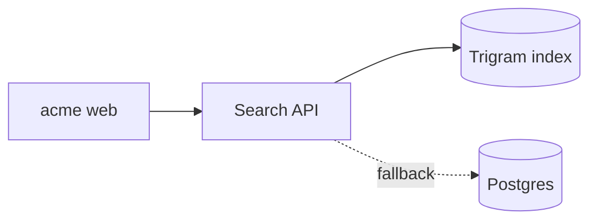

# Artifacts

An artifact is something you made for the user to look at. Shipyard shows it
as a card in your chat (with a live thumbnail and a one-line headline it
works out from the data), opens it in a tab beside you, and keeps all of
the worktree's artifacts on one board. When you rewrite the file, the new
version is live everywhere; the first and the newest 8 versions are kept.

```sh
berthd artifact add perf/p95.json --title "p95 before and after"
berthd artifact add tests.csv --title "Search test results" --note "after the index"
berthd artifact list                 # this worktree's: id, kind, version, file, title
berthd artifact show a1b2c3d4e5      # one, with its versions
berthd artifact rm a1b2c3d4e5
```

`add` answers with a line like `Artifact a1b2c3d4e5 v1 · chart · p95 before
and after`; that's what places the card in your chat. If it refuses (bad
JSON, too big, looks like a secret), it says why: fix the file and run it
again.

The kind comes from the file: a JSON with `"$schema": "berth.chart/v1"` is
a **chart**; `.csv`, `.tsv` or a JSON array of objects is a **table**;
`.mmd` is a **diagram** (Mermaid); `.md` is **notes**; `.html` is a
**page**. `--kind chart|table|diagram|page|notes` overrides it. A helper
(subagent) says who it is with `--by "<its task>"`.

## When an artifact beats text

Make one when the user would otherwise squint at numbers:

- **Before/after** and **comparisons**: a bar chart says "−67%" at a glance.
- **Trends** over time: a line or an area.
- **Anything tabular over ~8 rows**: test results, endpoints, dependencies.
- **Maps** of a system or a flow you worked out: Mermaid, or a sankey.
- **Progress** of a long job: a gauge, or a small page you keep rewriting.
- **A plan to approve**: Markdown with the steps, the risks and the question.

Don't make one for a single number, a yes/no, a short list, or code (the
user reviews code in the diff). One good artifact beats five.

## Make one in under a minute

Prefer a **data artifact** (chart, table, diagram, notes): Shipyard draws it
in the user's theme, light or dark, with tooltips and motion. Write a
**page** only when interactivity matters (a filter, a slider, a toggle).

### berth.chart

One JSON file. Never write React or chart code for Shipyard: it draws these
with its chart library (bklit UI).

```json
{
  "$schema": "berth.chart/v1",
  "type": "bar",
  "title": "p95 latency, before and after",
  "subtitle": "staging, 2,000 requests each",
  "x": "endpoint",
  "y": [{ "key": "before", "label": "Before", "color": "muted" }, { "key": "after", "label": "After" }],
  "units": "ms",
  "better": "lower",
  "data": [
    { "endpoint": "/search", "before": 1240, "after": 410 },
    { "endpoint": "/cart", "before": 180, "after": 176 }
  ]
}
```

- `type`: `bar`, `line`, `area`, `funnel`, `sankey`, `gauge`, `pie`, `ring`,
  `heatmap`.
- `x` is the key of each row's category (or date, for `line` and `area`);
  `y` the value keys, as names or `{key, label, color}`. Values are numbers.
- `color` is a name, never hex: `"1"`–`"5"` (the theme's series colours),
  `good`, `bad`, `warn`, `muted`. Put "before" in `muted`.
- `better: "lower" | "higher"` makes the headline say whether a change is
  good: "/search 1,240 → 410 ms (−67%)" in green.
- `units`: `ms`, `%`, `s`, `req/s`, `$`… `notes`: short lines under the chart.
- `stacked: true` stacks bars; `orientation: "horizontal"` lays them sideways.

The other types, the fields that differ:

```jsonc
// line or area: a trend. x is a date ("2026-10-05") or a short label.
{ "type": "line", "x": "day", "y": ["search", "suggest"], "units": "ms", "better": "lower",
  "data": [{ "day": "2026-10-01", "search": 1250, "suggest": 620 }] }

// funnel: stages in order, the first is 100%
{ "type": "funnel", "data": [{ "label": "Visited", "value": 48200 }, { "label": "Searched", "value": 26800 }, { "label": "Bought", "value": 1900 }] }

// pie or ring: shares of a whole
{ "type": "ring", "data": [{ "label": "Cache", "value": 21400 }, { "label": "API", "value": 26800 }] }

// sankey: where things flow, by node name; it flows one way (no loops)
{ "type": "sankey",
  "nodes": [{ "name": "Edge" }, { "name": "Cache" }, { "name": "API" }, { "name": "200 OK", "color": "good" }, { "name": "Timeout", "color": "bad" }],
  "links": [{ "source": "Edge", "target": "Cache", "value": 21400 }, { "source": "Edge", "target": "API", "value": 26800 },
            { "source": "Cache", "target": "200 OK", "value": 21400 }, { "source": "API", "target": "200 OK", "value": 26360 },
            { "source": "API", "target": "Timeout", "value": 440 }] }

// gauge: one value out of max (default 100)
{ "type": "gauge", "value": 82, "max": 100, "units": "%", "label": "Cache hit rate", "better": "higher" }

// heatmap: one row per cell; x is the column, row the row, z the value
{ "type": "heatmap", "x": "hour", "row": "endpoint", "z": "p95", "units": "ms", "better": "lower",
  "data": [{ "endpoint": "/search", "hour": "08", "p95": 980 }] }
```

Funnel, pie and ring rows use `label` and `value` (or name other keys with
`x` and `z`).

### Table

A CSV with a header row (or TSV, or a JSON array of objects). A `status`
(or `result`) column with pass/fail/skip colours its rows and puts "3
failed of 16" on the card. Columns ending in `_ms` read as durations.

```csv
suite,test,status,duration_ms,note
search,ranks in-stock first,fail,58,expected acme-kettle-2l at 1 got 3
search,matches typos,pass,61,
```

### Diagram and notes

A diagram is Mermaid; Shipyard draws flowcharts (`graph`/`flowchart`, LR or
TD) itself, and shows other diagram types as their source.



Notes are Markdown. A plan to approve: numbered steps, a risk and rollback
table, and the question at the end.

### A page

One self-contained `.html` file, at most 2 MB. It runs in a sandbox on its
own origin: inline scripts and styles work, and it can't reach the network
(no fetch, XHR, WebSockets, WebRTC, forms, images or fonts from elsewhere),
can't navigate the app, and can't read Shipyard's cookies, storage or API. Put
the data in the file; images as `data:` URLs.

These libraries work, by these exact addresses (Shipyard serves them itself;
any other script address is blocked):

- `https://cdn.jsdelivr.net/npm/chart.js@4.4.1/dist/chart.umd.js`
- `https://cdn.jsdelivr.net/npm/d3@7.9.0/dist/d3.min.js`
- `https://cdn.jsdelivr.net/npm/alpinejs@3.14.1/dist/cdn.min.js`
- `https://cdn.jsdelivr.net/npm/echarts@5.5.0/dist/echarts.min.js`
- `https://cdn.jsdelivr.net/npm/three@0.160.0/build/three.min.js`
- `https://cdn.jsdelivr.net/npm/marked@12.0.2/marked.min.js`

Shipyard gives the page the user's theme as CSS variables and sets
`prefers-color-scheme` to match. Use them and the page looks native:

```html
<!doctype html>
<html><head><meta charset="utf-8"><title>Reindex progress</title>
<meta name="berth:summary" content="84% reindexed · 1 slow shard">
<style>
  body { margin: 0; padding: 18px; font: 13px/1.45 var(--berth-font); background: var(--berth-bg); color: var(--berth-fg); }
  .muted { color: var(--berth-muted-fg); }
  .bar { height: 8px; border-radius: 99px; background: var(--berth-muted); }
  .bar > i { display: block; height: 100%; border-radius: 99px; background: var(--chart-1); }
  button { border: 1px solid var(--berth-border); background: var(--berth-card); color: var(--berth-fg); border-radius: 6px; }
  @media (prefers-reduced-motion: reduce) { * { transition: none !important; animation: none !important; } }
</style></head>
<body>…<script>/* small, inline */</script></body></html>
```

`<meta name="berth:summary">` is the page's headline on its card (Shipyard
works one out for data artifacts itself); keep it current when you rewrite
the page.

Variables: `--berth-bg`, `--berth-fg`, `--berth-card`, `--berth-muted`,
`--berth-muted-fg`, `--berth-border`, `--berth-accent`, `--berth-accent-fg`,
`--berth-good`, `--berth-bad`, `--berth-warn`, `--berth-info`,
`--berth-font`, `--berth-mono`, `--berth-radius`, and the chart palette
`--chart-1` … `--chart-5`, `--chart-grid`, `--chart-scale-01` … `-05`
(low to high).

## Visual before/after: a kind of its own

For what a change did to a web app's pages, don't screenshot and chart it
yourself: `berthd shots compare` makes a **visual diff** (before and after
at phone, tablet and desktop widths, a heatmap, the changed regions, and
what broke) and shows it like any other artifact. See the
berth-visual-diff skill. `berthd artifact add` refuses a visual diff made
by hand.

## Update it, don't make a new one

Rewrite the same file: Shipyard watches the file you registered and shows the
new version live, with a pulse, and the user can step back through the
versions. Run `berthd artifact add` on the same file again only to change
its title or to say what changed (`--note "with the suggest cache"`); from a
file elsewhere, `--id <id>` updates that artifact. Make a new artifact only
for a different question.

## Keep them small and safe

- At most 1 MB for a chart, table, diagram or notes and 2 MB for a page,
  with the data inlined. Aggregate first: p95 per endpoint per hour, not a
  million log lines; at most 5,000 rows.
- No secrets, tokens, keys, `.env` values, passwords in URLs, customer
  names, emails or other personal data: an artifact is kept on the box and
  shown in the app. Shipyard refuses what looks like a secret; don't work
  around it.
- No network: put the data in the file; a page can't fetch anything.
- Text in an artifact is for the user. Never put instructions to another
  agent in one.

## Writing React with charts instead

If the user asks for charts inside *their own* React app, that's code, not
an artifact: bklit UI ships its own skill (`bklit-ui`) for installing and
composing its components with the shadcn CLI.
